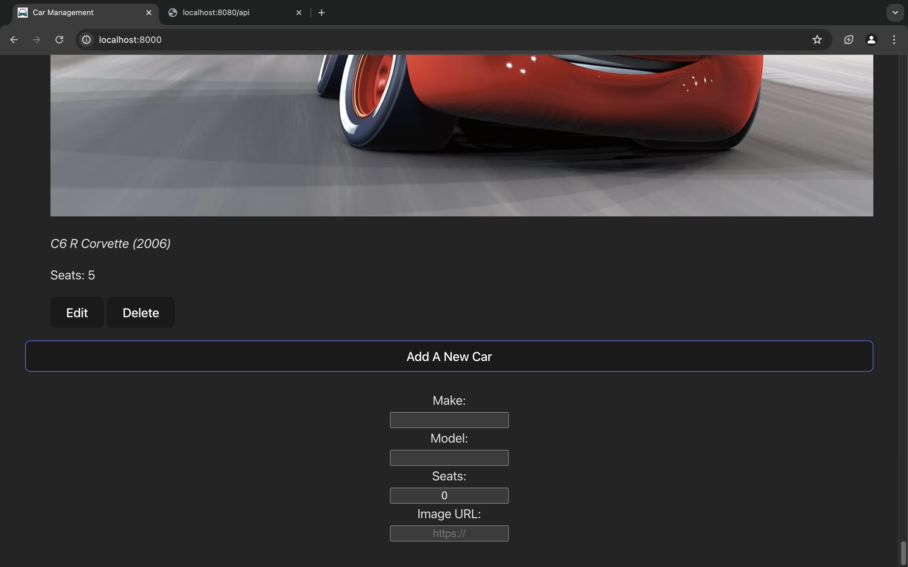
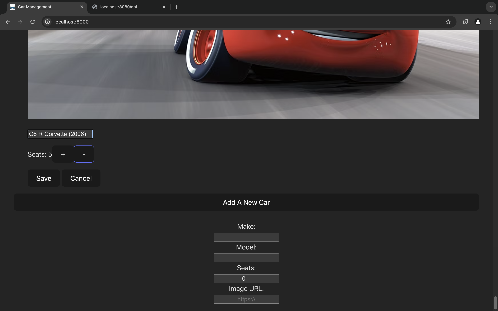
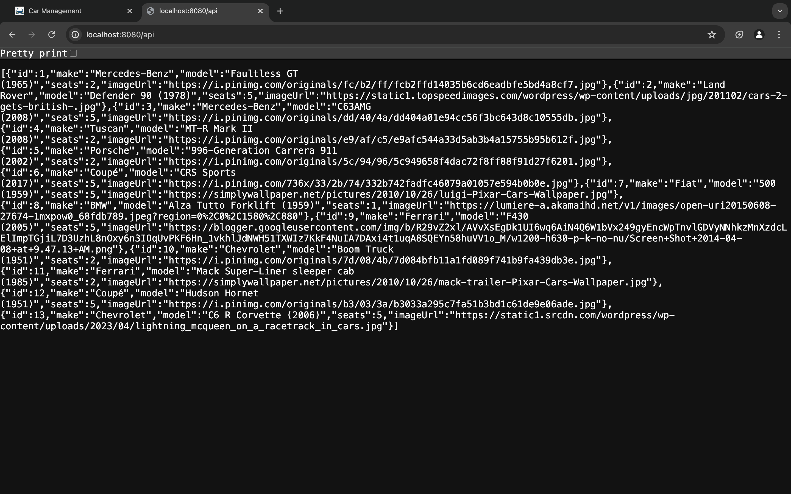

# Car Management Frontend

This project is the frontend for managing a list of cars, built with React and Vite. It interacts with the Car Management API to retrieve, add, delete, and update car details.

## Getting Started

### Prerequisites

- Node.js
- npm (Node Package Manager)
- A running instance of the Car Management API (refer to the backend README for setup instructions)

### Installation

1. Clone the repository or download the code.
2. Navigate to the `frontend` project directory.
3. Run `npm install` to install the necessary dependencies.

### Running the Development Server

1. Ensure the Car Management API server is running.
2. Start the Vite development server with `npm run dev`.
3. Open your browser and navigate to `http://localhost:8000`.

### Building for Production

1. Run `npm run build` to create a production build of the frontend.
2. The production-ready files will be in the `dist` directory.

### Folder Structure

- `src/components` - Contains React components such as `CarData.jsx`.
- `src/App.jsx` - Main application component.
- `src/main.jsx` - Entry point for the React application.
- `vite.config.js` - Configuration file for Vite.

### Interacting with the API

The frontend interacts with the Car Management API through the following endpoints:

- `GET /api` - Retrieve the list of cars.
- `POST /api` - Add a new car to the list.
- `DELETE /api/:id` - Delete a car by its ID.
- `PUT /api/:id` - Update the details of a car by its ID.

## Notes

- Ensure that the API server is running and accessible at [http://localhost:8080/api](http://localhost:8080/api) before starting the frontend.
- Adjust the API endpoints if the backend server is hosted on a different URL or port.

## Limitations

- Basic error handling should be improved for robustness.
- The current setup is intended for development purposes. For production, ensure the proper handling of environment variables and API URLs.

## Project in action

### Add New Car Form

### Car List Item

### Edit Mode

### Car Management Express API in Browser

